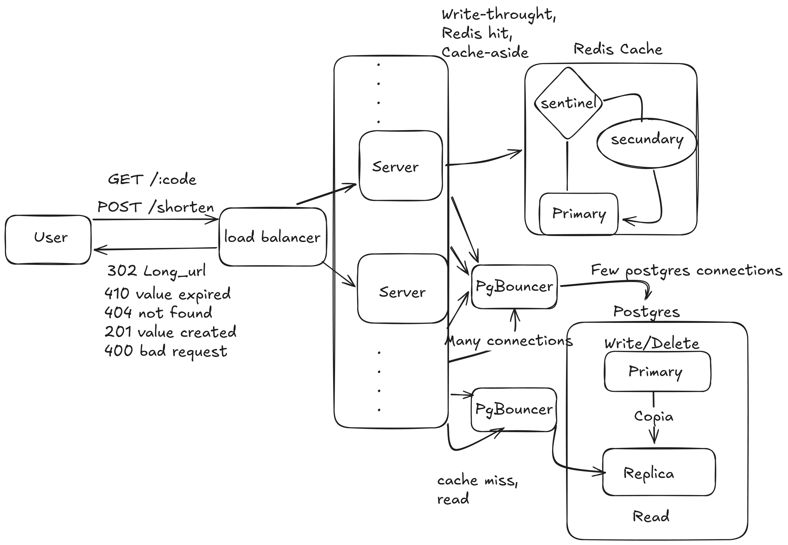

# URL Shortener — Design Document

> v1.0 · Redis + Postgres + Nginx · Base62 Encoding

---

## 1. Overview

This document covers the architectural decisions behind a URL shortening service, with emphasis on read performance and operational simplicity. The core challenge is not storing URLs — it's serving redirects at high volume with low latency.

A URL shortening service converts long URLs into short, shareable codes (e.g. `srt.ly/aB3xK2`). The service stores the mapping between short codes and original URLs, and redirects users via HTTP 302. Built for high read throughput with a Redis caching layer in front of Postgres, distributed across 3 stateless application servers behind Nginx.

---

## 2. API Design

### Endpoints

| Method | Path | Status | Description |
|--------|------|--------|-------------|
| POST | `/shorten` | 201 Created | Creates a short URL |
| GET | `/:code` | 302 Found | Redirects to original URL |
| GET | `/:code` | 404 Not Found | Code does not exist |
| GET | `/:code` | 410 Gone | Code existed but has expired |
| DELETE | `/:code` | 204 No Content | Deletes a short URL (auth required) |

No API versioning in v1. The `/shorten` path is intentionally flat — versioning (`/api/v1/shorten`) can be added later without breaking existing clients.

### Request / Response Formats

**POST /shorten**
```json
// Request
{ "url": "https://some-very-long-url.com/path?query=value" }

// Response 201
{ "short_url": "https://srt.ly/aB3xK2", "code": "aB3xK2", "expires_at": null }

// Response 400
{ "error": "invalid_url", "message": "URL must start with http:// or https://" }
```

**GET /:code**
```
HTTP 302   Location: https://some-very-long-url.com/path?query=value
HTTP 404   { "error": "not_found", "message": "Code does not exist" }
HTTP 410   { "error": "expired", "message": "This link has expired" }
```

The distinction between 404 and 410 is intentional: 404 means the code never existed; 410 means it existed but was intentionally removed or expired. This matters for SEO crawlers — 410 signals faster de-indexing than 404.

---

## 3. Short ID Generation

We use the Postgres serial ID converted to Base62 as the primary strategy for v1. Deterministic, collision-free, no coordination needed between app servers.

### Base62 Encoding

```
Alphabet: 0-9 (10) + a-z (26) + A-Z (26) = 62 characters

6 chars → 62^6 = ~56 billion unique URLs
7 chars → 62^7 = ~3.5 trillion unique URLs

Algorithm: repeatedly divide the integer ID by 62,
           map each remainder to the alphabet character.
```

### Approach Tradeoffs

| Approach | Pros | Cons | Collision Handling |
|---|---|---|---|
| ID → Base62 | No collision, deterministic, simple | Sequential = predictable IDs | None needed |
| MD5/SHA256 truncated | Deterministic per URL, no DB round-trip to generate | High collision rate when truncated | Retry with salt appended |
| Random 6 chars | Unpredictable, privacy-friendly | Collision possible at scale | Retry on duplicate key |
| UUID truncated | Simple to implement | Highest collision rate when truncated | Retry loop required |
| Snowflake ID | Distributed, no coordination, non-sequential | Requires instance ID config | None needed |
| NanoID | URL-safe, cryptographically random | Library dependency | Retry on duplicate key |

### Collision Handling (for random generation)

1. On `INSERT`, catch unique constraint violation (`PG error 23505`)
2. Retry up to 3 times with a newly generated code
3. If 3 retries fail → return HTTP 503 (statistically negligible under 56B URLs)

---

## 4. Storage

### Architecture: Redis + Postgres



**Redis** — cache layer
- Serves >95% of redirect reads at < 5ms p99
- Write-through: populated on every `/shorten`
- TTL: 24h default, configurable per URL
- Stores click counters via `INCR clicks:<code>` for async flush
- Eviction policy: `allkeys-lru`
- HA via Redis Sentinel

**Postgres** — source of truth
- All writes (INSERT) go to Primary
- Cache-miss reads go to Replica
- Connection pooling via PgBouncer

### Schema

```sql
CREATE TABLE urls (
    id          BIGSERIAL PRIMARY KEY,
    code        VARCHAR(10)  UNIQUE NOT NULL,  -- Base62 of id
    long_url    TEXT         NOT NULL,
    created_at  TIMESTAMPTZ  DEFAULT NOW(),
    expires_at  TIMESTAMPTZ,                   -- NULL = never expires
    user_id     BIGINT,                        -- NULL = anonymous
    click_count BIGINT       DEFAULT 0         -- updated async via Redis flush
);

CREATE INDEX idx_urls_code    ON urls(code);
CREATE INDEX idx_urls_expires ON urls(expires_at) WHERE expires_at IS NOT NULL;
```

`long_url` uses `TEXT` instead of `VARCHAR(2048)` — the 2048 character limit is enforced at the application layer, keeping schema migrations out of business rule changes. The partial index on `expires_at` only indexes rows with a non-null expiration, making the cleanup cron job faster and the index smaller.

### v1 Infrastructure Footprint

A common misconception is that v1 runs on a single Redis and a single Postgres. The actual minimum for a production-ready deployment is:

```
Redis Primary        ┐
Redis Replica        ├── 3 nodes minimum for HA via Sentinel
Redis Sentinel       ┘

Postgres Primary     ┐
Postgres Replica     ┘── 2 nodes minimum for read/write separation

App servers (2+)
Nginx
```

**Redis** requires 3 nodes because Sentinel needs a quorum to safely promote a Replica when the Primary fails. A single Redis node is a single point of failure — if it goes down, 100% of redirects fail immediately.

**Postgres** requires 2 nodes because the 1:100 write/read ratio makes running reads and writes on the same server impractical at any meaningful scale. The Replica can be added later, but the document assumes both from day one.

A true single-node setup for both is valid for local development only.

### Why This Storage Choice

- **Redis for reads**: p99 redirect latency < 5ms vs ~20ms for a Postgres cold read
- **Postgres for durability**: ACID guarantees, no data loss on Redis eviction or restart
- **Replica for scale**: redirects are ~100x more frequent than creates; Replica absorbs all read traffic without touching Primary
- **PgBouncer**: connection pooling prevents Postgres from being overwhelmed by N app servers

---

## 5. Redirect Flow

### Step-by-Step

```
GET /aB3xK2

1. Nginx receives request
   → applies rate limiting (100 req/min per IP)
   → forwards to one of 3 app servers (round robin)

2. App server queries Redis
   → GET aB3xK2

3a. Redis HIT (>95% of traffic)
    → INCR clicks:aB3xK2   (async counter, non-blocking)
    → return HTTP 302  Location: <long_url>

3b. Redis MISS
    → SELECT long_url, expires_at FROM urls WHERE code = 'aB3xK2'  [Replica]
    → not found?  → return HTTP 404
    → expired?    → return HTTP 410
    → found:
        → SET aB3xK2 <long_url> EX 86400   (repopulate cache)
        → INCR clicks:aB3xK2
        → return HTTP 302  Location: <long_url>
```

The redirect always points to the exact URL stored at creation time — including any query parameters that were part of the original URL. For example, if `https://site.com/blog?blog_id=1` was shortened, the redirect will always return `Location: https://site.com/blog?blog_id=1` intact.

Any query parameters appended to the short URL itself (e.g. `srt.ly/aB3xK2?utm_source=twitter`) are ignored in v1 — the redirect target is always the stored URL, unchanged. Parameter passthrough is deferred to a future version.

### 301 vs 302 — Critical Decision

> **Always use HTTP 302. This question alone eliminates most candidates in interviews.**

| | 301 Permanent | 302 Temporary |
|---|---|---|
| Browser behavior | Caches forever, never contacts server again | Always requests through server |
| Analytics | Impossible — clicks are invisible | Full visibility |
| Link updates | Cannot change destination | Can update or expire |
| Rate limiting | Bypassed after first visit | Always enforced |
| Latency | ~0ms (browser cache) | ~1–5ms (Redis hit) |

The 1ms latency cost of 302 is irrelevant. The loss of analytics from 301 is unacceptable for any URL shortener.

---

## 6. Edge Cases

### Same URL Submitted Twice

Every `POST /shorten` request always generates a new unique code, even if the long URL has been shortened before. This is an intentional design decision:

- **Privacy**: two users shortening the same URL would otherwise share a code and its click analytics
- **Campaign tracking**: a user may intentionally shorten the same URL multiple times to track different traffic sources independently
- **Simplicity**: no SELECT before INSERT — the write path is straightforward

The tradeoff is accumulation of duplicate entries in the database over time. This is acceptable because storage is cheap and query performance is unaffected given the indexed `code` column.

### Invalid URLs

Validation is handled entirely by a standard URL parser before any interaction with the database:

- Must start with `http://` or `https://`
- Must have a valid hostname (bare IPs disallowed unless configured)
- Max length: 2048 characters (enforced at application layer, not schema)
- Percent-encoding sequences must be well-formed: `%` must be followed by exactly two hexadecimal characters. Bare `%` characters or malformed sequences (e.g. `%off`, `%zz`) are rejected. The parser normalizes valid but unencoded characters automatically (e.g. spaces become `%20`) without risk of double-encoding already encoded sequences.

Return `HTTP 400` with a descriptive error message on any validation failure.

### Link Expiration

Expiration is enforced at two points:

1. **On read**: if `expires_at < NOW()` → return `HTTP 410 Gone` (not 404 — signals intentional expiry, important for SEO and crawlers)
2. **Background cleanup**: cron job runs daily → `DELETE FROM urls WHERE expires_at < NOW()`
3. **Redis TTL**: set to `min(user_ttl, 86400)` so expired links are never served stale from cache

### Original URL Goes Down

We do not validate that the destination URL is reachable. This is intentional:
- We are a routing layer, not a content validator
- URLs go down temporarily — we should not delete them for transient failures
- The user who created the link is responsible for the destination

*Future (out of v1 scope): optional async health-check for premium users.*

---

## 7. Scale

### 1 Million Concurrent Requests on One Link

This is the **thundering herd problem**.

- **Redis absorbs it**: a single Redis node handles 100k+ ops/sec. Redis Cluster scales linearly. All HITs never touch Postgres.
- **Stateless app servers**: add more instances behind Nginx with zero config changes. No shared state.
- **Click counter**: uses `INCR` (atomic, O(1), non-blocking) instead of an `UPDATE` per request to Postgres.
- **Nginx rate limiting**: per-IP limits prevent a single actor from monopolizing capacity.

### Caching Strategy

| Strategy | Where | Description |
|---|---|---|
| Write-through | `/shorten` | Every new URL is immediately written to Redis on creation |
| Cache-aside | `/:code` miss | On miss, app fetches from Postgres and populates Redis |
| TTL | Redis | 24h default. Hot links can receive longer TTL via background job |
| Eviction | Redis | `allkeys-lru` — evicts least recently used keys when memory is full |

### CDN Placement

A CDN (e.g. Cloudflare) in front of Nginx provides:

- **Edge caching**: for non-analytics links, CDN serves 302 at the nearest PoP — zero origin load
- **DDoS protection**: absorbs volumetric attacks before reaching app servers
- **Global latency**: redirects served from the edge instead of a single datacenter region

> Caveat: CDN-cached redirects bypass analytics. Use `Cache-Control: no-store` on analytics-sensitive links.

### Read Replicas

Yes, required at moderate scale. Write/read ratio is approximately **1:100** for a typical URL shortener. The Replica receives all `SELECT` queries from cache misses, freeing the Primary to handle only `INSERT` and cleanup. Without a Replica, the Primary becomes the read bottleneck as cache miss rate grows.

Replication lag (typically a few milliseconds) is acceptable for redirects — consistency requirements here are low. The Primary is never used for reads.

### Load Balancer and Ingress Options

Nginx and Kubernetes are not competing alternatives — Nginx runs inside Kubernetes as an Ingress Controller. The real choice is between different infrastructure approaches:

| Approach | Pros | Cons | Best For |
|---|---|---|---|
| Nginx standalone | Simple to operate, no orchestration overhead | Manual scaling, no self-healing | v1, small teams, predictable traffic |
| Nginx + Kubernetes | Auto-scaling, self-healing, rolling deploys | High operational complexity, steep learning curve | Teams with DevOps, unpredictable traffic |
| HAProxy | Higher throughput than Nginx for pure load balancing | No static file serving, less flexible | Extreme volume where load balancing is the bottleneck |
| Traefik | Native Docker/Kubernetes integration, auto-discovers services | Less mature than Nginx, smaller community | Kubernetes-first setups from day one |
| Cloudflare / AWS ALB | Zero-ops, built-in DDoS and rate limiting | Vendor lock-in, cost at scale, privacy considerations | Teams that want to eliminate infra management |

The natural progression for this service:

```
v1  →  Nginx standalone      simple, predictable, small team
v2  →  Nginx + Kubernetes    when traffic becomes unpredictable
v3  →  Traefik or cloud ALB  when the team has infra maturity to simplify
```

### Containerization and Orchestration

Each app server runs as a Docker container — a self-contained image with the application and all its dependencies. This guarantees identical behavior across every instance, regardless of when it was started or which machine it runs on.

In production, Kubernetes orchestrates these containers:

```
Internet ──► CDN ──► Kubernetes Ingress (replaces Nginx)
                            ↓
                   ┌─────────────────────┐
                   │   App Pods (2–20)   │  ← auto-scales by CPU
                   │   stateless, Docker │
                   └─────────────────────┘
                         ↓         ↓
                       Redis     Postgres
```

The Kubernetes Ingress Controller replaces Nginx, handling load balancing and rate limiting natively. Auto-scaling rules replace the fixed "3 servers" assumption — pods scale up when CPU exceeds a threshold and scale down during low traffic, with a minimum of 2 pods for high availability.

Stateless app servers are a hard requirement here: Kubernetes starts and stops pods dynamically, so any pod must be able to handle any request without relying on local state from a previous request.

---

## 8. What We Are NOT Building in v1

> These features are intentionally excluded to maintain velocity and reduce surface area. Each can be added incrementally without redesigning the core system.

| Feature | Reason to Defer |
|---|---|
| User authentication | Adds auth layer complexity; anonymous links prove the core model first |
| Custom aliases (`/my-link`) | Collision space changes; needs a separate validation and reservation flow |
| Analytics dashboard | Click counters are already stored in Redis; the UI is a separate product surface |
| Link previews / OG metadata | Out of core redirect path; requires external HTTP calls and adds latency |
| QR code generation | Pure frontend feature; can be a client-side library with zero backend changes |
| Bulk URL creation API | Edge case; can be built on top of the existing `POST /shorten` endpoint |
| Query parameter passthrough | Changes redirect semantics; stored URL is always the redirect target in v1 |
| Destination health checks | Async checker adds infra complexity for unclear v1 value |
| Multi-region replication | Premature optimization; single-region with CDN handles early scale comfortably |

---

## Appendix: Expected Latencies

| Operation | Expected p99 |
|---|---|
| GET /:code — Redis HIT | < 5ms |
| GET /:code — Redis MISS (Replica) | 10–30ms |
| POST /shorten | 20–50ms |
| Redis INCR (click counter) | < 1ms |
| Postgres write (Primary) | 5–15ms |

**Target**: >95% of all redirects should be Redis HITs. If cache hit rate drops below 80%, investigate TTL configuration or memory pressure.
